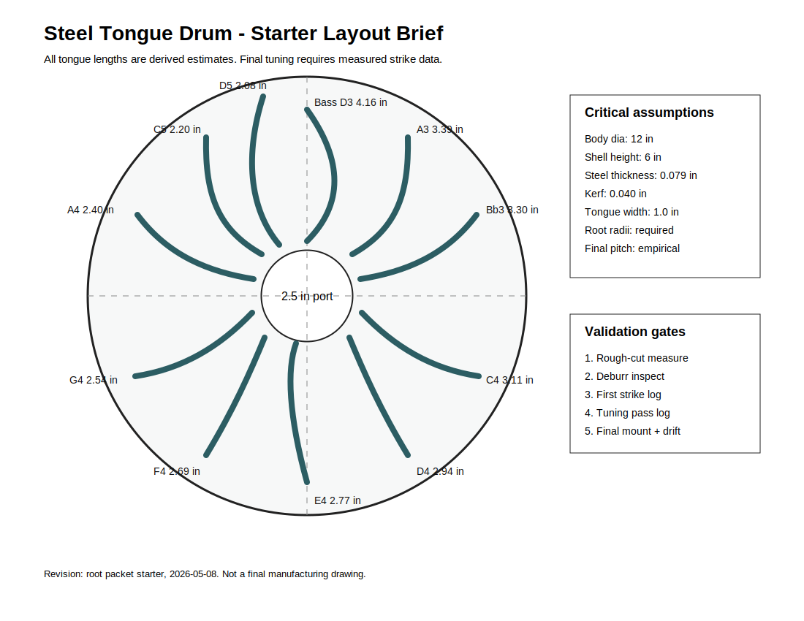

# Steel Tongue Drum Capstone
- Musical instrument documentation capstone
- Build packet: steel-tongue-drum
- Generated: 2026-05-08

---

# Project Intent
- Create a traceable root-mode packet for a tuned steel tongue drum. The packet documents the first-pass geometry from `steel-tongue-drum-design-table.xlsx`, the manufacturing assumptions that can move pitch, and the validation workflow needed to turn estimates into a tuned instrument.

_Speaker notes:_ Read design.md before committing to dimensions or sourcing decisions.

---

# Physics Model
- Use the cantilever beam model only as an initial layout estimate:

```
f = K_steel * t / L^2
L = sqrt(K_steel * t / f)
```

_Speaker notes:_ Governing equations extracted verbatim from design.md. Apply empirical corrections (NAF K2, scale offsets) only where the model permits — see references/acoustic-models.md.

---

# How To Use This Packet
- Start with design.md for intent and assumptions.
- Use bom.csv, sourcing.csv, and cut-list.csv before buying or cutting.
- Use drawing-brief.md and CAD/CNC folders before machining.
- Print the packet for shopping, shop work, and validation.

---

# File Map
- design.md: Project intent, catalog metadata, assumptions, and validation plan.
- bom.csv: Starter bill of materials with part categories, quantities, drawing refs, and notes.
- sourcing.csv: Supplier/search tracker with specs, price/date fields, lead time, substitutes, and risks.
- cut-list.csv: Rough/final stock sizes, material, grain/orientation, operations, yield, and offcuts.
- drawing-brief.md: Manufacturing drawing and technical product sketch brief.
- assembly-manual.md: Shop-facing sequence, tools, fixtures, safety, tuning, finishing, and maintenance notes.
- validation.csv: Target/measured values, tolerance, environment, result, and tuning/build action log.
- supplier-rfq.md: Supplier email/request-for-quote starter.

---

# Family Spec

| family_id | member_id | instrument_name | variant | key_or_scale | body_diameter_in | shell_height_in | steel_thickness_in | tongue_count | port_diameter_in | design_stage | validation_state | notes |
| --- | --- | --- | --- | --- | --- | --- | --- | --- | --- | --- | --- | --- |
| STD-FAM-001 | STD-001 | Steel Tongue Drum | 12 inch root prototype | D-centered mixed pentatonic/diatonic study | 12.0 | 6.0 | 0.079 | 11 | 2.5 | root-mode packet | no measured prototype data | Derived from steel-tongue-drum-design-table.xlsx; final tuning empirical. |

_Speaker notes:_ Sizes scale via the master scale factor; tuning targets are first-order Helmholtz/cantilever predictions to be empirically corrected per prototype.

---

# Build Workflow
- Design and assumptions
- Source materials and hardware
- Prepare stock, fixtures, and CNC/laser/lathe setup
- Assemble, tune, finish, and validate

---

# Sourcing And BOM
- BOM gives part categories and drawing references.
- Sourcing tracks search terms, supplier candidates, price/date, lead time, substitutions.
- Visual BOM brief turns the parts list into a presentation-ready image board.

---

# Shop Packet
- Cut list for lumber/sheet/blank planning.
- Assembly manual for away-from-keyboard work.
- Validation sheet for measured dimensions, tuning, pass/fail checks.

---

# Drawings, CAD, CNC
- drawing-brief.md defines required views, dimensions, datums, sketch intent.
- cad/ holds models and design tables.
- cnc/ holds CAM, toolpaths, setup sheets, dry-run notes.
- drawings/ holds PDFs, SVGs, DXFs, drawing exports.



---

# Images And Screenshots
- Add hero render/photo, visual BOM, shop screenshots, drawing previews, validation photos in images/.

---

# Validation Plan
- A4 = 440 Hz reference check.
- Tuning targets logged in validation.csv.
- Critical dimensions verified against design sheet and CAD.
- Photos and revision notes after each major step.

---

# Open Risks / Decisions
- TBDs in design sheet and BOM.
- Supplier price/availability not yet verified.
- Generated images marked as concept placeholders.
- Empirical corrections await measured prototype data.

---

# Next Actions
- Replace TBDs with measured/source-backed values.
- Verify live supplier price and availability before buying.
- Export final drawings and visual BOM images.
- Regenerate this deck and print packet after final edits.

---
